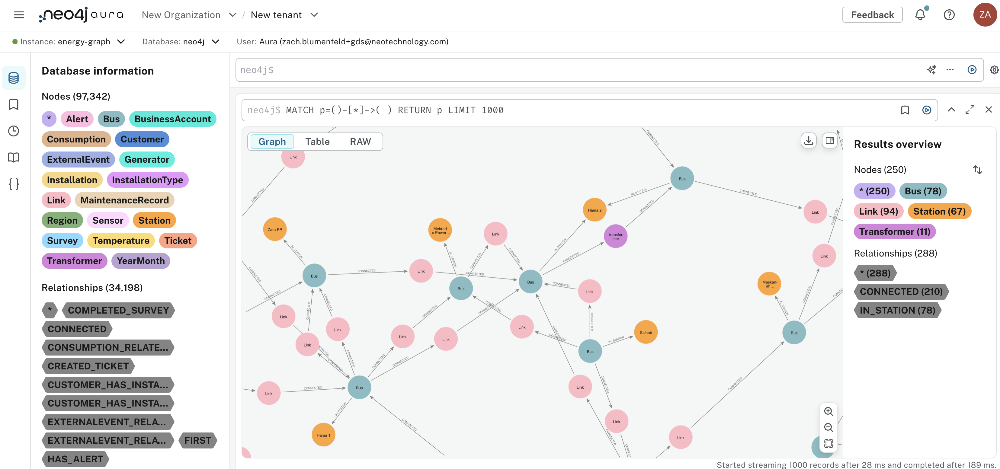
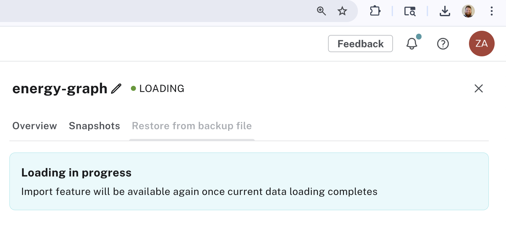
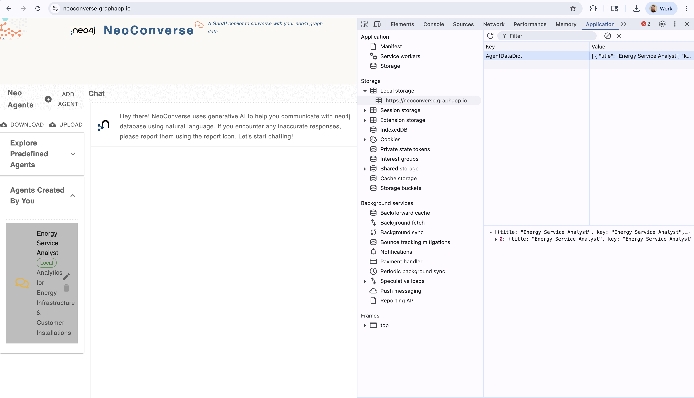
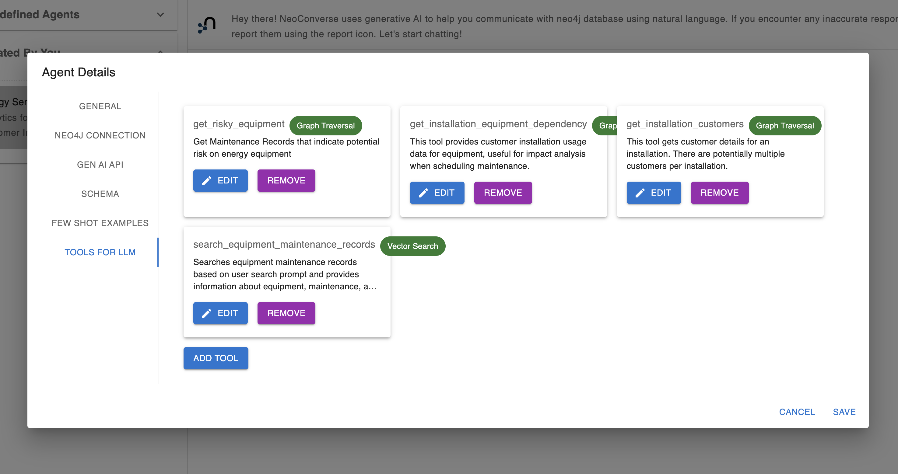

# GraphRAG Energy Agent Example Using NeoConverse



This is an example of constructing tools with [NeoConverse](https://neo4j.com/labs/genai-ecosystem/neoconverse/) to leverage Agentic GraphRAG for energy grid risk assessment and maintenance scheduling use cases.

The data for this demo comes from a combination of publicly available [ENTSO-E](https://www.entsoe.eu/) data and synthetic generated data using AI tools to help augment text and other fields.

The below walks through creating a graph, configuring NeoConverse with the appropriate tools, and sample questions you can ask to test the resulting agent.

> **Note: Other Agentic GraphRAG Examples**
>
> This energy example is relatively simple with a very minimal agent. To see richer end-to-end graph construction and multi-agent workflows, take a look at these examples:
>
> - [Supplier and bill of materials (BOM)](https://github.com/neo4j-product-examples/neo4j-supplier-graph)
> - [Employee/HR knowledge graph](https://github.com/neo4j-product-examples/neo4j-employee-graph)
>
> Both examples provide deeper insights into building high-quality agents and comprehensive graph construction workflows. They are a bit more technical, opting for Google's Agent Development Kit (ADK) framework.

## Create the Graph

**Prerequisites:**

1. **Neo4j Instance:** Create a Neo4j AuraDB instance at https://console.neo4j.io/ using the free Aura Pro trial. During setup, you'll download a credentials file needed for later configuration.

2. [OpenAI API key](https://platform.openai.com/api-keys)

**Graph Creation:**

You can create the graph in the above Neo4j DB in a couple of ways:

1. Create the graph from source data files by running the `create-graph.ipynb` notebook in [this GitHub repository](https://github.com/neo4j-product-examples/neo4j-energy-graph). Simply clone the repo, `pip install -r requirements.txt`, and create a `nb.env` file with the appropriate credentials using `nb.env.template` as a reference. Then you can run the entire notebook.

2. Download [this Neo4j DB backup file](https://github.com/neo4j-product-examples/neo4j-energy-graph/blob/main/neo4j-energy-graph.backup) and import it into your AuraDB instance by selecting the instance in the Aura console, then select "Backup & Restore" -> "Restore from backup file" and drag and drop the backup. You will see the loading screen below while the database updates.



Both ways will produce the same graph. The first way will just let you see the ETL & data mapping process from tables and text files.

## Configure NeoConverse

We will use [NeoConverse](https://neo4j.com/labs/genai-ecosystem/neoconverse/) to prototype a graphRAG agent. To set it up with all the right tools:

1. Download the json file [here](https://github.com/neo4j-product-examples/neo4j-energy-graph/blob/main/energy-agent-neoconverse.json) and substitute:
   - `<YOUR OPENAI API KEY>` with a valid OpenAI API key (it appears in two places).
   - the connection json:
     ```json
     "connection": {
       "port": "7687",
       "database": "neo4j",
       "host": "xxxxxx.databases.neo4j.io",
       "password": "<password>",
       "protocol": "neo4j+s",
       "username": "neo4j"
     }
     ```
     with your Neo4j credentials from above.

2. Go to NeoConverse and open the developer console. In Chrome this is generally:
   - `Cmd + Option + J` or `Option + ⌘ + I` on a Mac
   - `Ctrl + Shift + J` or `F12` on Windows

3. In the developer console go to Application → Local Storage and replace the `AgentDataDict` value with the content of that json file (just copy and paste in), and reload the page. If you do not see an `AgentDataDict`, go ahead and create one by pressing the "Add Agent" button in the left side-panel, this should make an `AgentDataDict` key-value pair appear.

4. After this, reload the page and you should get an agent to appear in the left side-panel called "Energy Service Analyst".



You should be able to open up the agent details in the left side-panel and look at the "TOOLS FOR LLM" page to explore relevant tools. The relevant tools for us will be:

1. `search_equipment_maintenance_records`
2. `get_risky_equipment`
3. `get_installation_equipment_dependency`



## Sample Questions

Below are some sample questions you can ask:

1. Search equipment that presented vibration issues and list and summarize the description. Provide the maintenance history and calculate the average number of days between maintenance. Structure the information in topics. Also, suggest a possible relationship between maintenance and alerts.

2. Can you develop a maintenance schedule over the next two weeks to address high-risk equipment while minimizing installation disturbance? Please provide specific dates, times, and maintenance activities. It is Feb 18th 2025 today.

This should produce responses using the tools configured. Below is a video with outputs from a previous run:

<iframe src="https://drive.google.com/file/d/1TbqMBmnUVj9TP6Wp_z3ST2tmlnABYnEU/preview" width="640" height="480" allow="autoplay"></iframe>

Note that these responses can be further improved with more agent instructions, tools, and tuning. You can customize this even further with agent frameworks like LangChain and Google Agent Development Kit (ADK). See the [supplier](https://github.com/neo4j-product-examples/neo4j-supplier-graph) and [employee](https://github.com/neo4j-product-examples/neo4j-employee-graph) examples for use with ADK.